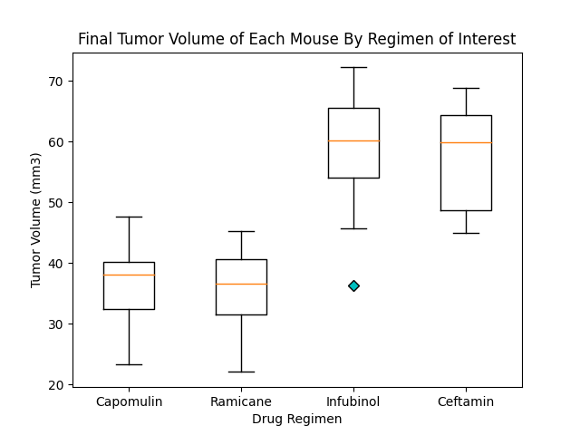
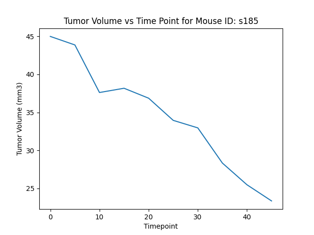

# Matplotlib: The Power of Plots

## Objective: 
Compare the performance of Capomulin versus various other regimens in treating squamous cell carcinoma (SCC). You have been tasked by the executive team to generate all of the tables and figures needed for the technical report of the study. The executive team also has asked for a top-level summary of the study results.

## Results: 

Ultimately, while Capomulin is one of the most promising treatment regimens, the Ramicane regimen performed just as well - if not better. 

> Ramicane had a lower median tumor volume than Capomulin after 45 days of treatment.

For at least one mouse treated with Capomulin, the tumor volume increased for a period before continuing to shrink. 

> Mouse s185 was treated with Capomulin for 45 days. The largest change in tumor volume occurred between days 5 and 10. Then, curiously, the tumor volume increased between days 10 and 15.